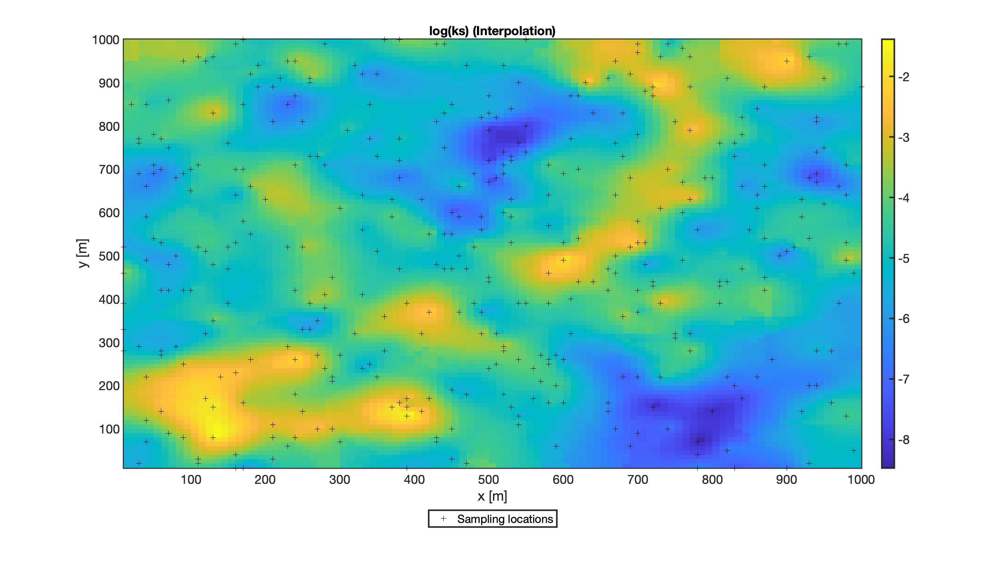
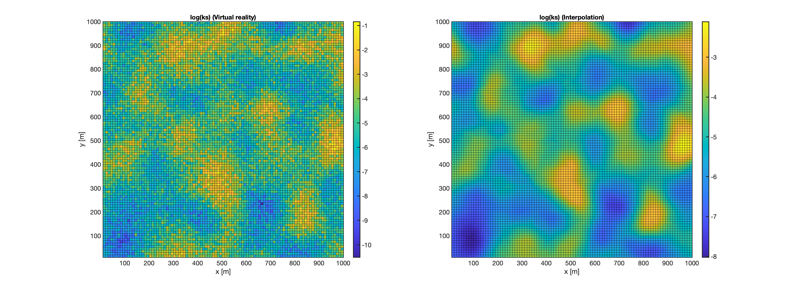

# Matlab orthophoto cropping tool

cropAnyShape.m

(c) Felix Leidinger, Marina Bortolli 2019
 
This function performs ordinary kriging. Define variogram and data source, run.

# Results

Sampling from file + interpolation:



Generation of virtual reality + sampling + interpolation:




# Repo structure

```
.
|-- README.md
|-- i_love_kriging.m
|-- ks_gaus_0,5_1,5_100.dat
|-- measurement_sk.dat
|-- measurement_tb.dat
|-- measurement_tb_2.dat
|-- op_mode_1.png
|-- op_mode_2.png
|-- real_area.dat
`-- variogram_details.dat

0 directories, 10 files


This tree was created by the following command:
work@leidix:~$ tree --dirsfirst --charset=ascii .
```

